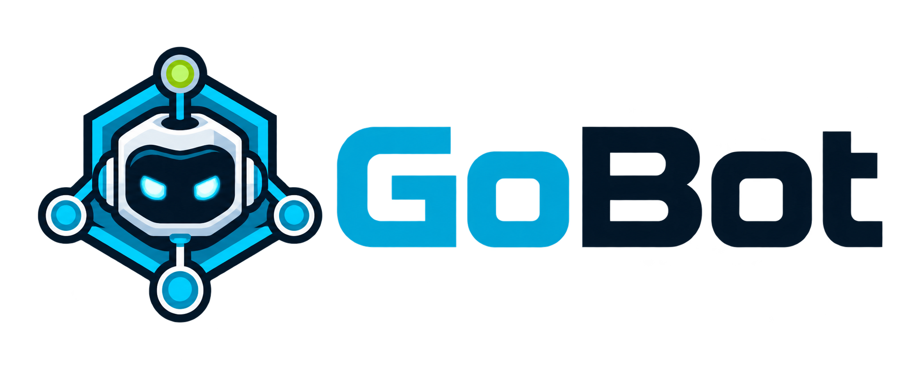

# GoBot

<p align="center">
  
</p>

[](https://github.com/variablenix/GoBot/actions/workflows/ci.yml)
[](https://github.com/variablenix/GoBot/actions/workflows/codeql.yml)
[](go.mod)
[](LICENSE)

GoBot is an extensible Go IRC bot for long-running use on one or more IRC
networks. It supports TLS/SASL authentication, multiple networks and
channels, persistent plugin data, rate-limited responses, games, reminders,
source-grounded question answers, URL titles, and Prometheus metrics.
It also includes keyless CVE, package, OSV, Docker Hub, and IP/ASN lookups,
Opengist pastes, local crypto/encoding and port utilities, local acronym
expansion, and a persistent word-scramble game.

The repository contains example connection settings so you can see the
configuration shape. Replace them with the networks, channels, identity, and
secrets for your own deployment.

## Contents

- [What GoBot does](#what-gobot-does)
- [Quick start](#quick-start)
- [Documentation map](#documentation-map)
- [Built-in plugins](docs/plugins.md#plugin-index)
- [Project layout](#project-layout)
- [Contributing](CONTRIBUTING.md)
- [License](#license)

## What GoBot does

Each configured network connection:

- connects over TLS and can authenticate with SASL PLAIN or certificate-based SASL EXTERNAL
- can perform an explicit one-time CertFP enrollment with existing SASL credentials; see [NickServ and SASL](docs/nickserv-sasl.md)
- joins any number of configured channels
- listens for channel, private, and invite events
- dispatches messages to enabled plugins
- reconnects with backoff after network failures
- paces outbound messages to avoid flooding
- supports optional external lookups with bounded timeouts and local-only
  catalogs/games where no service is needed

Stateful features store their data in a local BoltDB database. Runtime
counters are exposed through `/stats` and `/metrics`; cumulative counters
are also persisted so they survive restarts.

## Quick start

Requirements:

- Go `1.26.6+` or a newer supported release
- IRC network access
- a writable data directory

1. Review `config.yaml` and add your networks and channels.
2. Copy `.env.example` to `.env` and add secrets such as SASL or API keys.
   When enabling paste, also set `BOT_PASTE_BASE_URL` and `BOT_PASTE_TOKEN`.
3. Build the binary with `make build` or `./scripts/build.sh`.
4. For a direct launch, export the `.env` values before starting the binary:
   `set -a; . ./.env; set +a; ./bin/irc-bot`. GoBot reads environment variables;
   it does not parse `.env` itself.

For a service-managed deployment, use the [systemd and deployment
guide](docs/deployment.md). Docker and Docker Compose are also documented
there; those launchers load `.env` for you.

## Documentation map

| Guide | Covers |
| --- | --- |
| [Deployment](docs/deployment.md) | Build, run, systemd, Docker, and first-run workflow |
| [Configuration](docs/configuration.md) | Multi-network config, channels, invites, rate limits, and formatting |
| [Plugins](docs/plugins.md) | Built-in plugin behavior and command reference |
| [Games and activities](docs/games.md) | Blackjack, pool, polls, reminders, Duck Hunt, dice, and choices |
| [NickServ and SASL](docs/nickserv-sasl.md) | Nickname registration and secure authentication |
| [Banter and fortune](docs/banter-fortune.md) | Optional banter, quotes, and curated fortune files |
| [News](docs/news.md) | NewsAPI setup and commands |
| [Monitoring](docs/monitoring.md) | `/stats`, `/metrics`, Prometheus, and Grafana |
| [Security](docs/security.md) | Deployment and runtime security guidance |
| [Development and CI](docs/development.md) | Project workflow, tests, CI, CodeQL, and Dependabot |

Owners can send GoBot a private `reload` message to apply reloadable plugin
configuration without dropping the IRC connection. See
[Configuration](docs/configuration.md#owner-only-private-reload) for the
authentication and reload boundaries.

## Project layout

```text
cmd/irc-bot/       application entrypoint
bot/               IRC connection, config, queue, stats, and interfaces
plugins/           built-in plugins and tests
data/foods/        local food, cuisine, and beer suggestion lists
data/fun/          local joke, pun, one-liner, and wisdom catalogs
data/welcome.txt   short original join-greeting catalog
data/acronyms.txt  operator-editable ACRONYM|expansion[|context] catalog
data/scramble.txt  local word-scramble catalog
data/weapons.txt   local high-level firearm and weapons-name catalog
data/sports.txt    local sports suggestion list
data/cars.txt      local car make/model suggestion list
data/ports.txt     local IANA well-known port/service catalog
storage/           BoltDB wrapper used by stateful plugins
quotes/            built-in quote and response files
grafana/           importable Prometheus dashboard and preview
scripts/            build, publishing, and systemd helpers
deploy/systemd/    systemd unit template
CONTRIBUTING.md    contribution workflow and local checks
```

The binary is generated at `bin/irc-bot`; it is a build artifact, not source
code. See [Development and CI](docs/development.md) for local checks.

## License

MIT
